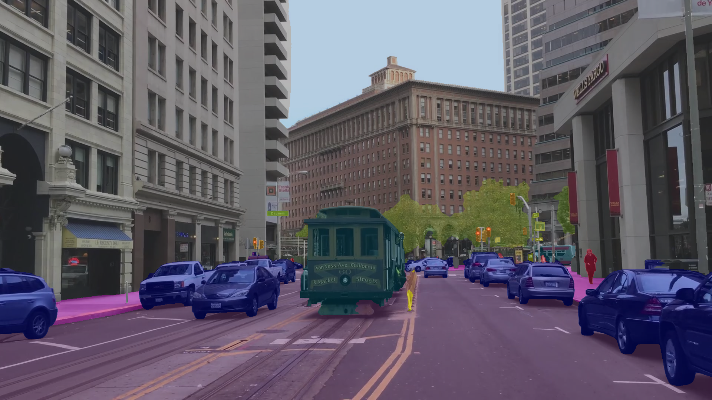

### [Paper](https://arxiv.org/abs/2005.10821) | [YouTube](https://youtu.be/odAGA7pFBGA)  | [Cityscapes Score](https://www.cityscapes-dataset.com/method-details/?submissionID=7836) <br>

Pytorch implementation of our paper [Hierarchical Multi-Scale Attention for Semantic Segmentation](https://arxiv.org/abs/2005.10821).<br>

Please refer to the `sdcnet` branch if you are looking for the code corresponding to [Improving Semantic Segmentation via Video Prediction and Label Relaxation](https://nv-adlr.github.io/publication/2018-Segmentation).

## Installation 

* The code is tested with pytorch 1.3 and python 3.6
* You can use ./Dockerfile to build an image.


## Download Weights

* Create a directory where you can keep large files. Ideally, not in this directory.
```bash
  > mkdir <large_asset_dir>
```

* Update `__C.ASSETS_PATH` in `config.py` to point at that directory

  __C.ASSETS_PATH=<large_asset_dir>

* Download pretrained weights from [google drive](https://drive.google.com/open?id=1fs-uLzXvmsISbS635eRZCc5uzQdBIZ_U) and put into `<large_asset_dir>/seg_weights`

## Download/Prepare Data

If using Cityscapes, download Cityscapes data, then update `config.py` to set the path:
```python
__C.DATASET.CITYSCAPES_DIR=<path_to_cityscapes>
```

* Download Autolabelled-Data from [google drive](https://drive.google.com/file/d/1DtPo-WP-hjaOwsbj6ZxTtOo_7R_4TKRG/view?usp=sharing)

If using Cityscapes Autolabelled Images, download Cityscapes data, then update `config.py` to set the path:
```python
__C.DATASET.CITYSCAPES_CUSTOMCOARSE=<path_to_cityscapes>
```

If using Mapillary, download Mapillary data, then update `config.py` to set the path:
```python
__C.DATASET.MAPILLARY_DIR=<path_to_mapillary>
```


## Running the code

The instructions below make use of a tool called `runx`, which we find useful to help automate experiment running and summarization. For more information about this tool, please see [runx](https://github.com/NVIDIA/runx).
In general, you can either use the runx-style commandlines shown below. Or you can call `python train.py <args ...>` directly if you like.


### Run inference on Cityscapes

Dry run:
```bash
> python -m runx.runx scripts/eval_cityscapes.yml -i -n
```
This will just print out the command but not run. It's a good way to inspect the commandline. 

Real run:
```bash
> python -m runx.runx scripts/eval_cityscapes.yml -i
```

The reported IOU should be 86.92. This evaluates with scales of 0.5, 1.0. and 2.0. You will find evaluation results in ./logs/eval_cityscapes/...

### Run inference on Mapillary

```bash
> python -m runx.runx scripts/eval_mapillary.yml -i
```

The reported IOU should be 61.05. Note that this must be run on a 32GB node and the use of 'O3' mode for amp is critical in order to avoid GPU out of memory. Results in logs/eval_mapillary/...

### Dump images for Cityscapes

```bash
> python -m runx.runx scripts/dump_cityscapes.yml -i
```

This will dump network output and composited images from running evaluation with the Cityscapes validation set. 

### Run inference and dump images on a folder of images

```bash
> python -m runx.runx scripts/dump_folder.yml -i
```

You should end up seeing images that look like the following:



## Train a model

Train cityscapes, using HRNet + OCR + multi-scale attention with fine data and mapillary-pretrained model
```bash
> python -m runx.runx scripts/train_cityscapes.yml -i
```

The first time this command is run, a centroid file has to be built for the dataset. It'll take about 10 minutes. The centroid file is used during training to know how to sample from the dataset in a class-uniform way.

This training run should deliver a model that achieves 84.7 IOU.

## Train SOTA default train-val split
```bash
> python -m runx.runx  scripts/train_cityscapes_sota.yml -i
```
Again, use `-n` to do a dry run and just print out the command. This should result in a model with 86.8 IOU. If you run out of memory, try to lower the crop size or turn off rmi_loss.
