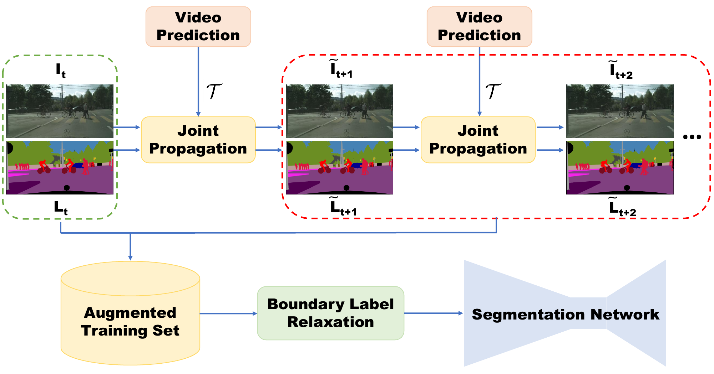
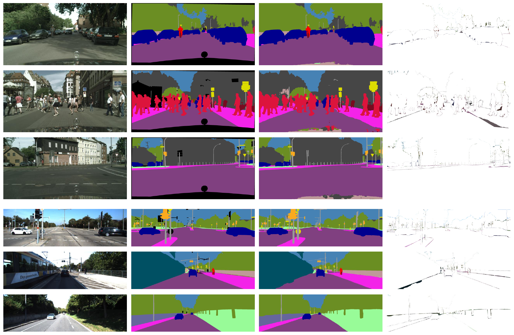

# [Improving Semantic Segmentation via Video Prediction and Label Relaxation](https://nv-adlr.github.io/publication/2018-Segmentation)



## Installation 

    # Get Semantic Segmentation source code
    git clone https://github.com/NVIDIA/semantic-segmentation.git
    cd semantic-segmentation

    # Build Docker Image
    docker build -t nvidia-segmentation -f Dockerfile .

Our pytorch implementation of Semantic Segmentation using Deeplabv3-Plus to achieve SOTA on cityscapes. <br />
We are working on providing detail report, please bear with us. <br />
To propose a model or change for inclusion, please submit a pull request.

Multiple GPU training is supported, and the code provides examples for training or inference. <br />
For more help, type <br/>
      
    python train.py --help

## Network architectures

Below are the different base network architectures that are currently provided. <br />

 - **WideResnet38**
 - **SEResnext(50)-Stride8** 
 
 We have also support in our code for different model trunks but have not been tested with current repo. 
 - **SEResnext(50)-Stride8** 
 - **Resnet(50,101)-Stride8**
 - **Stride-16** 
  
## Pre-trained Models
We've included pre-trained models. Download checkpoints to a folder `pretrained_models`. 

* [pretrained_models/cityscapes_best.pth](https://drive.google.com/file/d/1P4kPaMY-SmQ3yPJQTJ7xMGAB_Su-1zTl/view?usp=sharing)[1071MB]
* [pretrained_models/camvid_best.pth](https://drive.google.com/file/d/1OzUCbFdXulB2P80Qxm7C3iNTeTP0Mvb_/view?usp=sharing)[1071MB]
* [pretrained_models/kitti_best.pth"](https://drive.google.com/file/d/1OrTcqH_I3PHFiMlTTZJgBy8l_pladwtg/view?usp=sharing)[1071MB]
* [pretrained_models/sdc_cityscapes_vrec.pth.tar](https://drive.google.com/file/d/1OxnJo2tFEQs3vuY01ibPFjn3cRCo2yWt/view?usp=sharing)[38MB]
* [pretrained_models/FlowNet2_checkpoint.pth.tar](https://drive.google.com/file/d/1hF8vS6YeHkx3j2pfCeQqqZGwA_PJq_Da/view?usp=sharing)[620MB]


## Data Loaders

Dataloaders for Cityscapes, Mapillary, Camvid and Kitti are available in [datasets](./datasets). <br />

### Python requirements 

Currently, the code supports 
* Python 3
* Python Packages
* numpy 
    * PyTorch ( == 0.5.1, for <= 0.5.0 )
    * numpy
    * sklearn
    * h5py
    * scikit-image
    * pillow
    * piexif
    * cffi
    * tqdm
    * dominate
    * tensorboardX
    * opencv-python
    * nose
    * ninja
* An NVIDIA GPU and CUDA 9.0 or higher. Some operations only have gpu implementation.
 
# Running the code

## Training 

Dataloader: To run the code you will have to change the datapath location in  `config.py` for your data.
Model Arch: You can change the architecture name using `--arch`.
   
`./train.sh `

## Inference

Our inference code supports two path pooling and sliding based eval. The pooling based eval is faster than sliding based eval but provides slightly lower numbers.    
   `./eval.sh <weight_file>`
   
## Label propagation using Video Prediction 
```
cd ./sdcnet
bash flownet2_pytorch/install.sh
./_eval.sh
```

## Results on Cityscapes



# Training IOU

Training results for WideResnet38 and SEResnext50 trained in fp16 on DGX-1 (8-GPU V100)

<table class="tg">
  <tr>
    <th class="tg-t2cw">Model Name</th>
    <th class="tg-t2cw">Mean IOU</th>
    <th class="tg-t2cw">Training Time</th>
  </tr>
  <tr>
    <td class="tg-rg0h">DeepWV3Plus(no sdc-aug)</td>
    <td class="tg-rg0h">81.4</td>
    <td class="tg-rg0h">~14 hrs</td>
  </tr>
  <tr>
    <td class="tg-rg0h">DeepSRNX50V3PlusD_m1(no sdc-aug)</td>
    <td class="tg-rg0h">80.0</td>
    <td class="tg-rg0h">~9 hrs</td>
  </tr>
</table>

## Reference 

If you find this implementation useful in your work, please acknowledge it appropriately and cite the paper or code accordingly:

```
@InProceedings{semantic_cvpr19,
  author       = {Yi Zhu*, Karan Sapra*, Fitsum A. Reda, Kevin J. Shih, Shawn Newsam, Andrew Tao, Bryan Catanzaro},
  title        = {Improving Semantic Segmentation via Video Propagation and Label Relaxation},
  booktitle    = {IEEE Conference on Computer Vision and Pattern Recognition (CVPR)},
  month        = {June},
  year         = {2019},
  url          = {https://nv-adlr.github.io/publication/2018-Segmentation}
}
* indicates equal contribution
```

```
@misc{semantic-segmentation,
  author = {Karan Sapra, Fitsum A. Reda, Yi Zhu, Kevin Shih, Andrew Tao, Bryan Catanzaro},
  title = {semantic-segmentation: improving semantic segmentation via video propagation and label relaxation},
  year = {2019},
  publisher = {GitHub},
  journal = {GitHub repository},
  howpublished = {\url{https://github.com/NVIDIA/semantic-segmentation}}
}

```
We encourage people to contribute to our code base and provide suggestions, point any issues, or solution using merge request, and we hope this repo is useful.  

## Acknowledgments

 Parts of the code were heavily derived from [pytorch-semantic-segmentation](https://github.com/ZijunDeng/pytorch-semantic-segmentation), [inplace-abn](https://github.com/mapillary/inplace_abn), [Pytorch](https://github.com/pytorch/vision/blob/master/torchvision/models/resnet.py), [ClementPinard/FlowNetPytorch](https://github.com/ClementPinard/FlowNetPytorch) and [Cadene](#https://github.com/Cadene/pretrained-models.pytorch)
 
 Our initial models used SyncBN from [Synchronized Batch Norm](https://github.com/zhanghang1989/PyTorch-Encoding) but since then have been ported to [Apex SyncBN](https://github.com/NVIDIA/apex) developed by Jie Jiang.

 We would also like to thank Ming-Yu Liu and Peter Kontschieder.
 
## Coding Style
* 4 spaces for indentation rather than tabs
* 100 character line length
* PEP8 formatting
